Updated: April 11, 2017

ChatBot Overview
=========================

### **What is a Chatbot?**

Intelligent Bots in Oracle Mobile Cloud Enterprise (or just Bots) is a conversational computing platform for the enterprise. 

You can think of your Bot as a virtual personal assistant, one that completes a task through a combination of text messages and simple UI elements like select lists. While a Bot can open your enterprise to messaging, it's not a replacement for a mobile or web app. It instead provides a new channel.

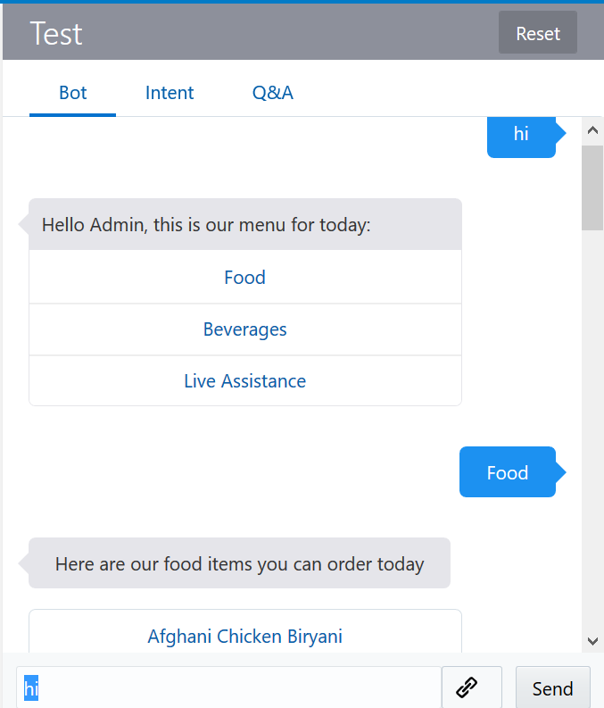

Bots enables you to connect your users to the enterprise while engaging them in naturalistic conversations. The Bots you create can respond to free-form user input because the Bots' language intelligence framework uses machine learning. While users are probably aware that they're chatting with a Bot, they don't need to limit or constrain their input.

You can build the Bot, test it, and configure it to run on different messaging services using the Bot Builder, a simple user interface. Although, you can run this Bot through Facebook Messenger and other platforms or websites, you need only write the bot once. Bots optimizes the Bot for the target platform.

### **How Do you create a Chatbot?**

Here's a bird's-eye view of bot development.

**Description of the illustration bots-overall-process.png**

**Create Intents**---You can start by creating Intents. Intents illustrate your use case by describing the various actions that your Bot helps its users complete. If your Bot enables users to perform various banking transactions, for example, then you could create intents like CheckBalance or TransferMoney. Intents not only describe what your Bot can do, but, they are also the key to your Bot's intelligence. They enable it to recognize user input because each Intent has a set of typical user statements known as utterances associated with it. While these phrases share the same meaning, they make your Bot resilient because they're also varied (for example, What's my savings account balance? and How much is in my checking account?).

**Train the Bot**---To enable your Bot to reference Intents when it parses the user input, you need to train it. Specifically, you need to train it with the Intents and their utterances (collectively, the training data), so that it can resolve the user input to one of the Intents. By training your Bot, you leverage the language intelligence which is at the core of the Bots platform. Its algorithms enable your Bot to not only recognize the sample phrases that belong to each intent, but similar phrases as well.

**Create Entities**---In some cases, you may need to provide some context to enable your Bot to complete a user request. While some user requests might resolve to the same intent, they are nonetheless asking for different things (for example, What's my savings account balance? and How much is in my checking account? would both resolve to the CheckBalance intent). To clarify the request, you would add an entity. Using the banking Bot example, an entity called AccountType, which defines values called checking and saving would enable the Bot to parse the user request and respond appropriately.

**Integrate Custom Components**---At this point, your Bot can recognize input, but it can't respond to it. To put your Bot's intelligence to work, you need to add components and then later, create a dialog flow. Components enable your Bot to do its job. There are two types of components: the ones provided by Bots that perform functions ranging from holding the resolved Intent to outputting text, and the ones that you provide. The components belonging to this latter category are known as custom components. Unlike the built-in components that you can use in any Bot that you build with the Bots platform, the custom components perform tasks that are specific to a single bot, like checking a user's age, or returning account information. Custom components don't reside within the Bots platform, so for your Bot to use them, you need to access them through a REST service.

**Create the Dialog Flow**---Next, you need to give the Bot the wherewithal to express its intelligence to its users by creating the dialog flow. The dialog flow describes how your Bot reacts as different Intents are resolved. It defines what your Bot says to its users, how it prompts them for input, and how it returns data. Think of the dialog flow as a flow chart that's been transposed to a simple markdown language. In Bots, this markdown language is a version of YAML called OBotML.

**Test the Bot**---Once you've started your dialog flow, you can chat with your Bot to test it out. You can see how the Tester works in [Building Your First Bot](https://docs.oracle.com/en/cloud/paas/mobile-suite/develop/bot-basics1.html#GUID-0C3BF9FB-563D-427C-8536-4E98C115CDB0).

**Configure Channels**---Users subscribe to your bot through messaging platforms such as Facebook Messenger, iOS App, Android App, and Web Page. You don't have to rewrite your Bot for each messaging platform, but you do need to configure a channel for each one. Bots enables you to integrate with Facebook Messenger quickly through its Facebook Channel. You don't need to craft any REST calls to run your Bot on Facebook. Instead, you complete a UI using artifacts that are generated by both Facebook and Bots. See [Running Your Bot on Facebook Messenger](https://docs.oracle.com/en/cloud/paas/mobile-suite/develop/bot-channels.html#GUID-CCEE3FD5-21F2-4288-9450-0D24202F2615). To integrate your Bot with other services, Bots provides the Webhook channel. You build your own Webhooks for these non-Facebook integrations. 


Start Lab 100 -- Create ChatBots with Intents, Entities, Utterances and Flow
----------------------------------------------------------------------------

### Objective

- Create four intents
    - Create utterances
- Add an entity and associate it with your intent for this chat bot creation.
- Define the Dialog flow of your bot
- Train ChatBot and test it

### **STEP 1**: Create a simple Cafeteria Assistance ChatBot

Log in to your AMCe and then, select Bots to create ChatBot.


And, then click the **New Bot** button


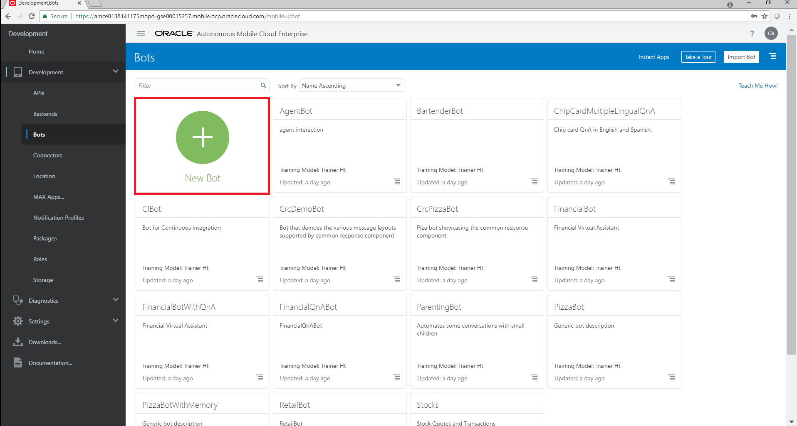

In the **Create Bot** dialog, name your bot (e.g. ChatBot CafeteriaAssistance_Bot). Then, add a description and click **Create?** .

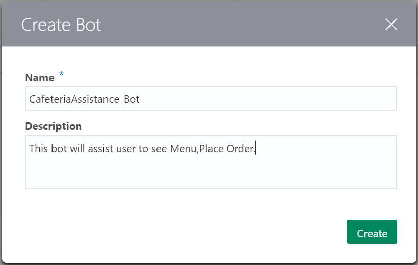

You are taken to the home page for your Bot. Here on the left, you can see a list of icons you can use to navigate to your **Intents, Entities, Flow, Resource Bundles, Q&A, Components, Settings and Quality**.

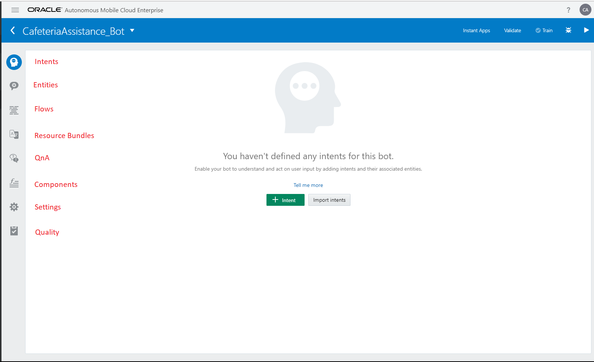

### **Step 2**: Add an Intent, Entity for show menu

From the homepage of your ChatBot, click the **Intent** icon present on left-side navigation bar and then click the green **Intent** button.

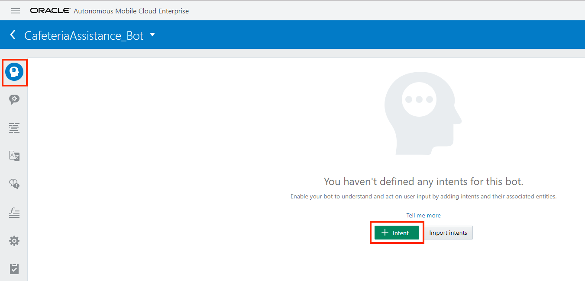

This Intent will be used to show the cafeteria menu. Enter **ShowMenu** as the Intent name, and then provide a description. These values are automatically saved, so you do not need to explicitly save them. As you create artifacts, you may notice a message in the lower right corner that your work has been saved.

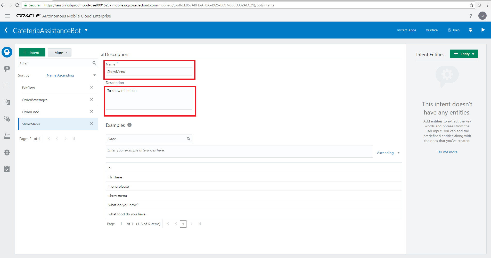

Now that you have an intent, to express what a show menu is. In the Examples area add the following text: **show menu**, followed by a return.

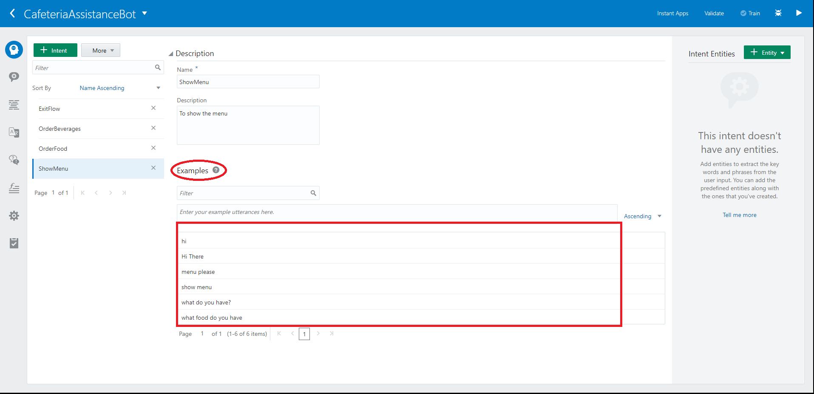

Add another example utterance: **what do you have?** Followed by a return.

Include the list of example utterances below to your intent, each followed by a return. Notice that the examples do not need to be in the form of a question, they can be a statement as well.

-   **hi**

-   **Hi There**

-   **menu please**

-   **show menu**

-   **What do you have?**

-   **What food do you have**

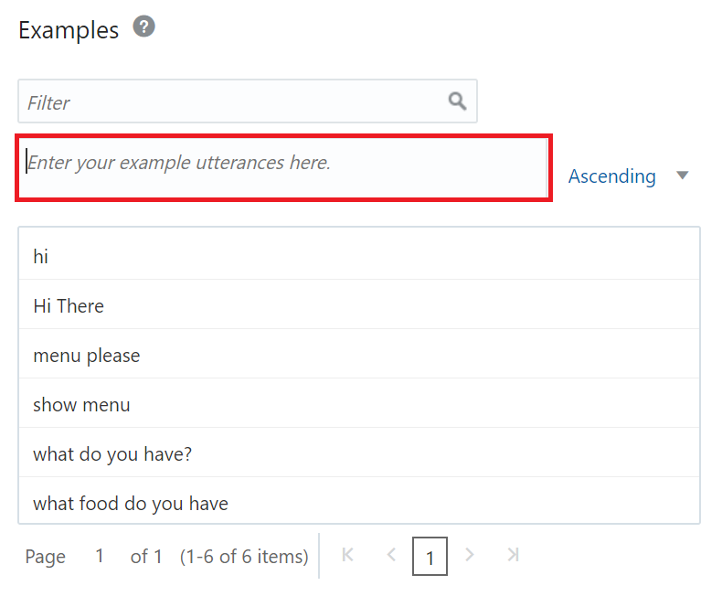

### **Step 3**: In the similar way add OrderFood intent:

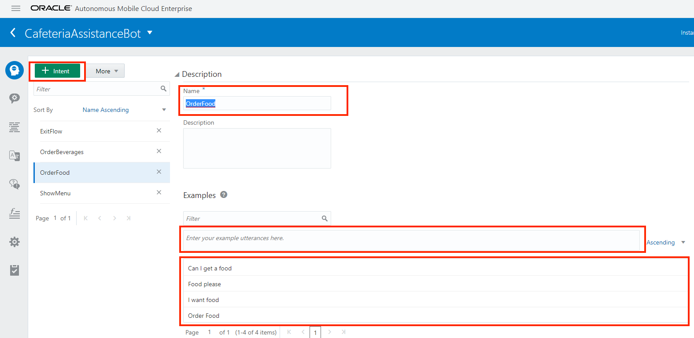

Add the below utterances for the OrderFood intent:

1.Can I get a food

2.Food please

3.I want food

4.Order Food
<!-- TODO: are utterances case sensitive? if not, remove #5 -->

<a name="step-4-add-an-intent-entity-for-order-beverage"></a>
### **Step 4**: In the similar way add OrderBeverages intent:

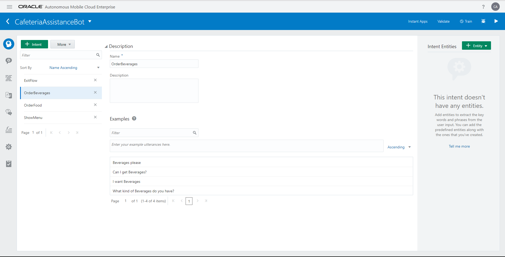

Add the below utterances for the OrderBeverages intent:

1\. Beverages please

2\. Can I get Beverages?

3\. I want Beverages
<!-- TODO: are utterances case sensitive? if not, remove #4 -->

4\. What kind of Beverages do you have?
<a name="step-5-add-an-intent-entity-for-exit-flow"></a>
### **Step 5**: In the similar way add ExitFlow intent:

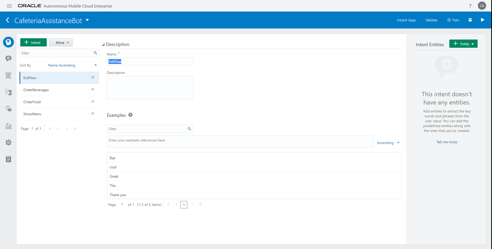

Add the below utterances for the ExitFlow intent:

1\. Bye

2\. Great

3\. Thank You

4\. Thank
<!-- TODO: are utterances case sensitive? if not, remove #5 -->

### **Step 6**: Now that the intent is created, add an entity.

If you want the list of options i.e. sizes (based on the quantity) in this Bot for the item which user can choose to order, you would probably need to show the list of different available sizes of the item.

On the left-navigation bar, click the second icon down named **"Entities"** and you'll be able to view pre-populated system entities. These are standard entities that can be used in your ChatBot without having to explicitly define them.


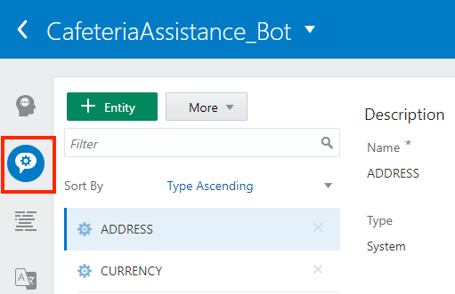

Click the green **Entity** button and then enter **ItemSize** as the entity name and a brief description.

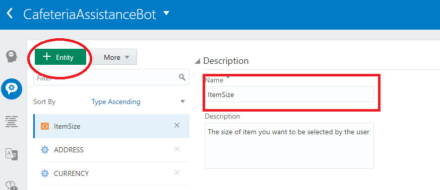

Now that you have an Entity, you need to provide some values that could be used. In our case of the **ItemSize**, you would want to use values that represent size you could query for the order.

In the **Configuration** area, ensure the **Type** property is set to Value List (To create the list of values based on the requirement) and then click the green **Value** button.


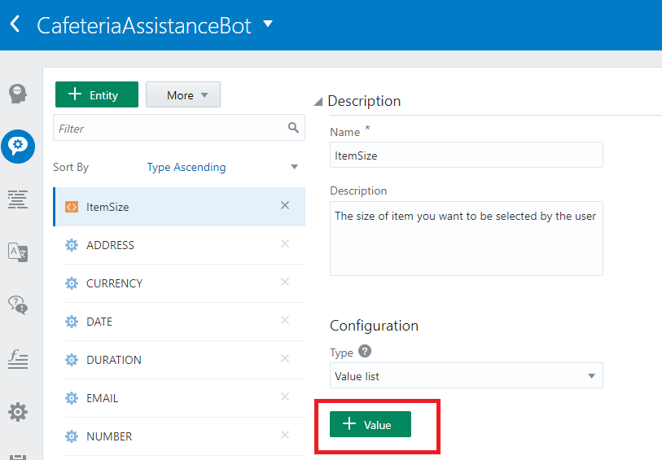

In the popup dialog, enter **Small** as the value and **small** as a synonym (followed by a return).

Then click **Create**.


Then, add a second value named **Medium** and this time add a synonym of **normal**.

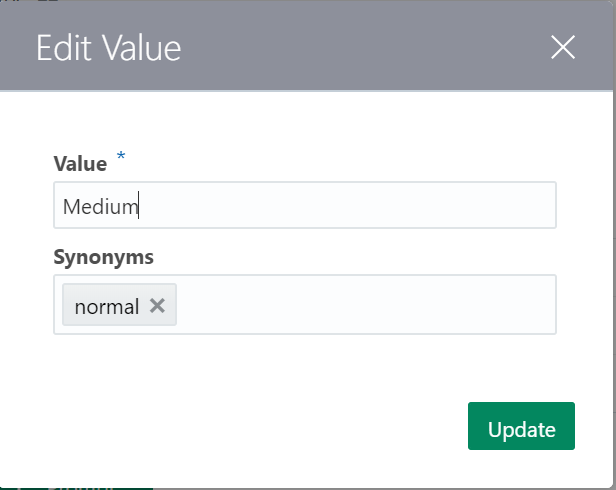

Finally, add a third value named **Large** and use **big** as the synonyms.

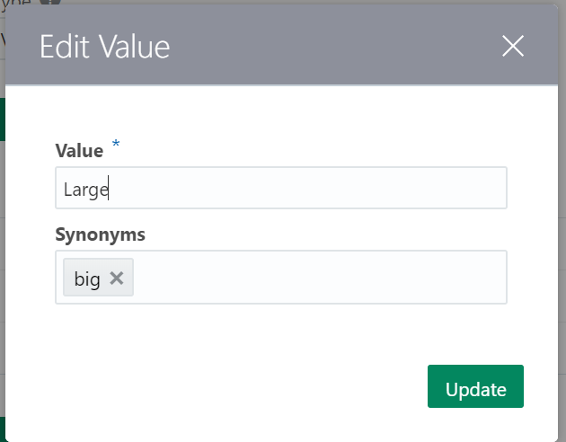

When finished, your entity definition should look like the image shown below.

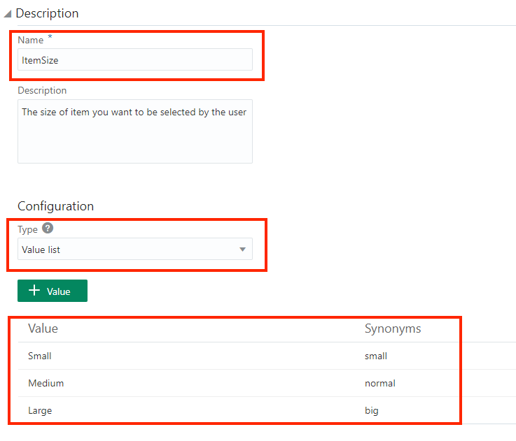

Now you've got 4 intents (ShowMenu, OrderFood, OrderBeverages and ExitFlow) and an entity named as ItemSize. You need to associate the **OrderFood** and **OrderBeverages** intents with **ItemSize** entity, and it's easy to do it.

On the left-navigation bar, click the **Intent** icon, and on the right, find the **Intent Entities** area.

Click the green **Entity** button and select **ItemSize** from the list, after selection your screen will look like image shown below:

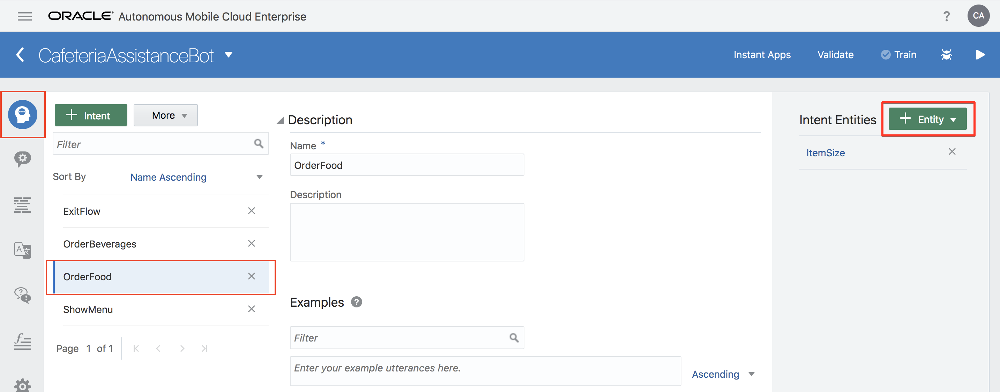

The entity is added and a required flag is set. If you want you can remove the entity by clicking the **(x)** to the right of the entity name. Do not remove the entity from your intent.

### **Step 7**: Define the Conversation Flow

With the intent and entity created, the next thing we need is a Dialog flow. Click the Flow icon on the left bar; some code has been added to display hello when activated.  For the sake of brevity, you can simply replace all the code with the below file content (Please click the below file to copy the content):

```
metadata:
  platformVersion: "1.1"
main: true
name: "CafeteriaAssistanceBot"
context:
  variables:
    iresult: "nlpresult"
    foods: "string"
    beverages: "string"
    dummy: "string"
    orderedFood: "string"
    orderedFoodImage: "string"
    itemSize: "ItemSize"
    location: "string"
    cardsRangeStart: "int"
    feedback: "string"
defaultTransitions:
  error: "DefaultErrorHandler"
  actions:
    unexpectedAction: "HandleUnexpectedAction"
    ExitFlow: "exitFlow"
states:
  setCardsRangeStart:
    component: "System.SetVariable"
    properties:
      variable: "cardsRangeStart"
      value: 0
    transitions: {}
  LoadFoods:
    component: "System.SetVariable"
    properties:
      variable: "foods"
      value:
      - name: "Afghani Chicken Biryani"
        description: "We took the all-time favorite and made it better by giving it an Afghani touch."
        image: "http://res.cloudinary.com/psjsaravana/image/upload/v1522685529/CafeteriaAssistant/Afghani-Chicken-Biryani_2.jpg"
      - name: "Black Forest Cake"
        description: "Black forest cake with a sinful layer of rich chocolate mousse."
        image: "http://res.cloudinary.com/psjsaravana/image/upload/v1522685529/CafeteriaAssistant/836x663-Black-Forest.jpg"
      - name: "Big Crunch Chicken Classic Burger"
        description: "Juicy chicken patty seared to perfection. Then, stuffed between soft oatmeal buns along with fresh veggies. So good, you will be tongue-tied."
        image: "http://res.cloudinary.com/psjsaravana/image/upload/v1522685528/CafeteriaAssistant/Big-Crunch-Chicken-Classic-Burger.jpg"
      - name: "Big Crunch Veg Cheese Burger"
        description: "Flavourful veggie patty cooked to perfection. Then, stuffed between soft oatmeal buns with handpicked veggies. Sure to make your eye widen and jaw drop."
        image: "http://res.cloudinary.com/psjsaravana/image/upload/v1522685528/CafeteriaAssistant/Big-Crunch-Veg-Cheese-Burger_2.jpg"
      - name: "Chilli Cheese Toastizza"
        description: "Get cheesy with this crispy toast topped with onions, tomatoes and capsicum, loaded with cheese and sprinkled with chilli flakes"
        image: "http://res.cloudinary.com/psjsaravana/image/upload/v1522685528/CafeteriaAssistant/Chilli-Cheese-Toastizza_2.jpg"
      - name: "Egg Wrap"
        description: "For the Desi at heart! Classic Indian egg bhurji with onions, capsicum and paprika, folded into a scrumptious Malabar paratha wrap."
        image: "http://res.cloudinary.com/psjsaravana/image/upload/v1522685529/CafeteriaAssistant/Egg-Wrap_2.jpg"
      - name: "Crackling Brownie"
        description: "A Rich gooey classic American fudge brownie"
        image: "http://res.cloudinary.com/psjsaravana/image/upload/v1522685529/CafeteriaAssistant/836x663-Brownie.jpg"
      - name: "Crispy Veg Wrap"
        description: "We made veggies taste good. You can thank us later."
        image: "http://res.cloudinary.com/psjsaravana/image/upload/v1522685528/CafeteriaAssistant/CrispyVeg_2.jpg"
    transitions: {}
  
  LoadBeverages:
    component: "System.SetVariable"
    properties:
      variable: "beverages"
      value:
      - name: "Alphonso Mango Milkshake"
        description: "Discover delight in every sip with this divine, sumptuous mango treat."
        image: "http://res.cloudinary.com/psjsaravana/image/upload/v1522769202/CafeteriaAssistant/mango-milkshake-recipe.jpg"
      - name: "Aztec single origin Coffee"
        description: "A delightful international gourment blend that includes a double shot of espresso brewed from a blend of imported coffee beans topped with steamed and foamed milk."
        image: "http://res.cloudinary.com/psjsaravana/image/upload/v1522769201/CafeteriaAssistant/Aztec_single_origin_Coffee.jpg"
      - name: "Classic Lemonade"
        description: "Get refreshed! Introducing a lemonade with a touch of mint and ginger that make for the perfect sip, when you are chillin'."
        image: "http://res.cloudinary.com/psjsaravana/image/upload/v1522769202/CafeteriaAssistant/Classic_Lemonade.jpg"
      - name: "Green Tea"
        description: "An aromatic tea that does wonders for your health. The leaves are mixed with Jasmine flower bits that give a distinct fragrance and flavour. Can be served either with milk or lemon."
        image: "http://res.cloudinary.com/psjsaravana/image/upload/v1522769202/CafeteriaAssistant/Green_Tea.jpg"
      - name: "Cool Blue"
        description: "Cool Blue, a syrupy blue blend skating on crushed ice! Zap away that summer heat and enjoy a tall glass of pure shock, as you plunge your mind into CCD's summer favourite!"
        image: "http://res.cloudinary.com/psjsaravana/image/upload/v1522769201/CafeteriaAssistant/Cool_Blue.jpg"
      - name: "Macchiato"
        description: "Macchiato, meaning 'Marked' is bold espresso with a small amount of foamed milk to compliment it."
        image: "http://res.cloudinary.com/psjsaravana/image/upload/v1522769202/CafeteriaAssistant/Macchiato.jpg"
      - name: "Cold Cocoa Latte"
        description: "Smooth, creamy ice cold chocolate milkshake. Who can say no to this classic beverage?"
        image: "http://res.cloudinary.com/psjsaravana/image/upload/v1522769201/CafeteriaAssistant/Cold_Cocoa_Latte.jpg"
      - name: "Café Americano"
        description: "A double shot of espresso topped with hot water, served with a complimentary milk on the side."
        image: "http://res.cloudinary.com/psjsaravana/image/upload/v1522769202/CafeteriaAssistant/Caf%C3%A9_Americano.jpg"
    transitions: {}  
  Intent:
    component: "System.Intent"
    properties:
      confidenceThreshold: 0.5
      variable: "iresult"
    transitions:
      actions:
        unresolvedIntent: "Unresolved"
        OrderBeverages: "OrderBeverages"
        ShowMenu: "ShowMenu"
        OrderFood: "OrderFood"
  Unresolved:
    component: "System.CommonResponse"
    properties:
      metadata:
        responseItems:
        - type: "text"
          text: "Sorry, I don't understand you, I am not human. Please try another\
            \ sentence."
          name: "Sorry"
          separateBubbles: true
      processUserMessage: false
    transitions:
      return: "done"
  ShowMenu:
    component: "System.CommonResponse"
    properties:
      metadata:
        responseItems:
        - type: "text"
          text: "Hello ${profile.firstName}, this is our menu for today:"
          name: "hello"
          separateBubbles: true
          actions:
          - label: "Food"
            keyword: "1"
            type: "postback"
            payload:
              action: "Food"
            name: "Food"
          - label: "Beverages"
            keyword: "2"
            type: "postback"
            payload:
              action: "Beverages"
            name: "Beverages"         
      processUserMessage: true
    transitions:
      actions:
        Food: "OrderFood"
        Beverages: "OrderBeverages"
        textReceived: "Intent"
  OrderFood:
    component: "System.CommonResponse"
    properties:
      metadata:
        responseItems:
        - type: "text"
          text: "Here are our food items you can order today"
          separateBubbles: true
          rendered: "<#if cardsRangeStart?number == 0>true<#else>false</#if>"
          name: "Our foods"
        - type: "text"
          text: "Some more items for you:"
          separateBubbles: true
          rendered: "<#if cardsRangeStart?number != 0>true<#else>false</#if>"
          name: "More food items"
        - type: "cards"
          cardLayout: "vertical"
          name: "FoodCards"
          actions:
          - label: "More food items"
            type: "postback"
            rendered: "<#if cardsRangeStart?number+4 < foods.value?size>true<#else>false</#if>"
            payload:
              action: "more"
              variables:
                cardsRangeStart: "${cardsRangeStart?number+4}"
            name: "More"
          cards:
          - title: "${foods.name}"
            description: "${foods.description}"
            imageUrl: "${foods.image}"
            name: "FoodCard"
            iteratorVariable: "foods"
            rangeStart: "${cardsRangeStart}"
            rangeSize: "4"
            actions:
            - label: "Order Now"
              type: "postback"
              payload:
                action: "order"
                variables:
                  orderedFood: "${foods.name}"
                  orderedFoodImage: "${foods.image}"
              name: "Order"
          channelCustomProperties:
          - channel: "facebook"
            properties:
              top_element_style: "large"
      processUserMessage: true
    transitions:
      actions:
        order: "AskItemSize"
        more: "OrderFood"
        textReceived: "Intent"
  
  OrderBeverages:  
    component: "System.CommonResponse"
    properties:
      metadata:
        responseItems:
        - type: "text"
          text: "Here are our beverages you can order today"
          separateBubbles: true
          rendered: "<#if cardsRangeStart?number == 0>true<#else>false</#if>"
          name: "Our beverages"
        - type: "text"
          text: "Some more items for you:"
          separateBubbles: true
          rendered: "<#if cardsRangeStart?number != 0>true<#else>false</#if>"
          name: "More beverages"
        - type: "cards"
          cardLayout: "vertical"
          name: "BeveragesCards"
          actions:
          - label: "More beverages items"
            type: "postback"
            rendered: "<#if cardsRangeStart?number+4 < beverages.value?size>true<#else>false</#if>"
            payload:
              action: "more"
              variables:
                cardsRangeStart: "${cardsRangeStart?number+4}"
            name: "More"
          cards:
          - title: "${beverages.name}"
            description: "${beverages.description}"
            imageUrl: "${beverages.image}"
            name: "BeveragesCard"
            iteratorVariable: "beverages"
            rangeStart: "${cardsRangeStart}"
            rangeSize: "4"
            actions:
            - label: "Order Now"
              type: "postback"
              payload:
                action: "order"
                variables:
                  orderedFood: "${beverages.name}"
                  orderedFoodImage: "${beverages.image}"
              name: "Order"
          channelCustomProperties:
          - channel: "facebook"
            properties:
              top_element_style: "large"
      processUserMessage: true
    transitions:
      actions:
        order: "AskItemSize"
        more: "OrderFood"
        textReceived: "Intent"
  AskItemSize:
    component: "System.CommonResponse"
    properties:
      variable: "itemSize"
      nlpResultVariable: "iresult"
      maxPrompts: 2
      metadata:
        responseItems:
        - type: "text"
          text: "<#if user.botsUserError == 'true'>Invalid size, please try again.\
            \ </#if>What size do you want?"
          name: "What size"
          separateBubbles: true
          actions:
          - label: "${enumValue}"
            type: "postback"
            payload:
              action: ""
              variables:
                itemSize: "${enumValue}"
            name: "size"
            iteratorVariable: "itemSize.type.enumValues"
      processUserMessage: true
    transitions:
      actions:
        cancel: "Intent"
      next: "AskLocation"
  AskLocation:
    component: "System.CommonResponse"
    properties:
      variable: "location"
      metadata:
        responseItems:
        - text: "To which location do you want the item to be delivered?"
          type: "text"
          name: "What location"
          separateBubbles: true
        globalActions:
        - label: "Send Location"
          type: "location"
          name: "SendLocation"
      processUserMessage: true
    transitions:
      actions:
        cancel: "Intent"
      next: "Confirmation"
  Confirmation:
    component: "System.CommonResponse"
    properties:
      metadata:
        responseItems:
        - text: "Thank you for your order, your ${itemSize} ${orderedFood} \
            \ will be delivered in 10 minutes at GPS position ${location.value.latitude},${location.value.longitude}!"
          type: "text"
          name: "conf"
          separateBubbles: true
        - type: "attachment"
          attachmentType: "image"
          name: "image"
          attachmentUrl: "${orderedFoodImage}"
      processUserMessage: false
    transitions:
      return: "done"
  HandleUnexpectedAction:
    component: "System.Switch"
    properties:
      variable: "user.botsUnexpectedAction"
      values:
      - "food"
      - "beverages"
      - "order"
    transitions:
      actions:
        NONE: "ActionNoLongerAvailable"
        food: "OrderFood"
        beverages: "OrderBeverages"
        order: "AskItemSize"
  ActionNoLongerAvailable:
    component: "System.Output"
    properties:
      text: "Sorry, this action is no longer available"
    transitions:
      return: "done"
  DefaultErrorHandler:
    component: "System.Output"
    properties:
      text: "Unexpected error occurred, please contact the helpdesk"
    transitions:
      return: "done"
  exitFlow:
    component: "System.Output"
    properties:
      text: "Alright. Have a nice day!"
      keepTurn: true
    transitions: {} 
```
### **Step 8**: Validate, Train and Test your ChatBot

Finally, click the **Validate** button in the upper right corner and you should see a message that there were no problems found in your bot.

In the next section, you train the Bot to recognize responses that might be entered and then test it.

In this part of the tutorial, you run the training tool on the Bot. This will train the Bot allowing it to understand similar user inputs to the example utterances used when building the Bot.

In the upper right, click the **Train** button. This will kick-off a process that will run an algorithm to take your example utterances and build the model that will be used to ascertain the intents and entities. Anytime the ChatBot platform recognizes your Bot needs to be trained, it will display an exclamation point in the train button. Once the training is complete the exclamation point is replaced by a check mark.


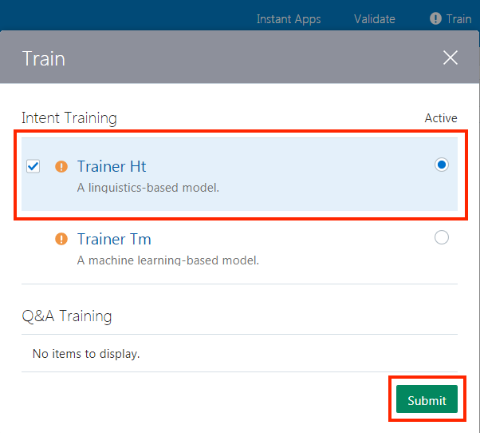

Oracle provides three models that learn from your corpus: Trainer Ht ,Trainer Tm and Q&A Training. Each uses a different algorithm to reconcile the user input against your intents. Trainer Ht uses pattern matching while Trainer Tm detects variations in user input and Q&A training is used to train for the pre-defined question and answers. You'd typically follow training process when you're creating intents:

a.  Choose Trainer Ht from the options.

b.  Refine your corpus, retrain with Trainer Ht. Repeat as necessary.

The Train button () activates whenever you add an intent or when you update an intent by adding, changing, or deleting its utterances. To bring the training up to date, choose a training model and then click **Train**. The model displays an exclamation point whenever it needs training. When its training is current, it displays a check mark.

To test the ChatBot, click the **play** (Run) icon in the upper right of the page. This takes you into the tester

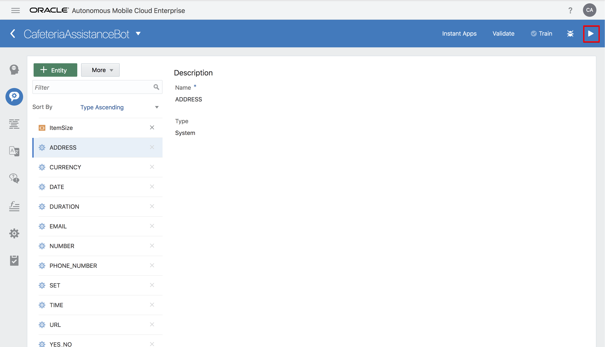

where you can see three tabs: Bot, Intent and QnA.


Click the **Bot** tab to test the bot. What you type in at the bottom in the **Message** area, is what will be sent to the bot when you click the **Send** button.

Let's start out simple to test the bot.

In the Message area, type **Show menu** and then click the **Send** button.


The bot will show cafeteria menu for you with two options.

Click one of the option i.e Food and the details for that item is displayed.

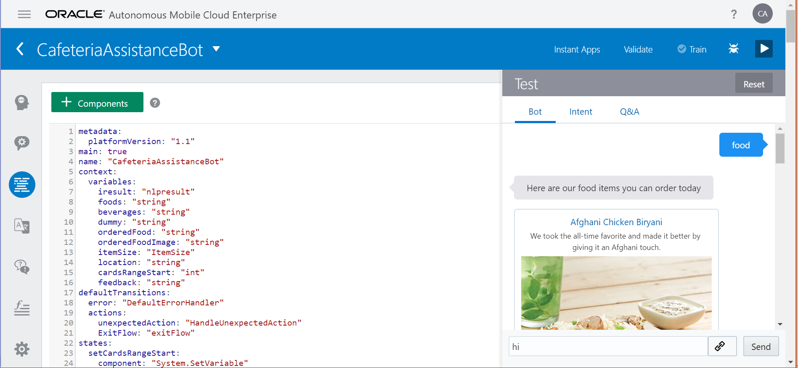

Now, let's try a message that includes the **ItemSize**.
<!-- TODO: need to include the instructions for testing ItemSize -->

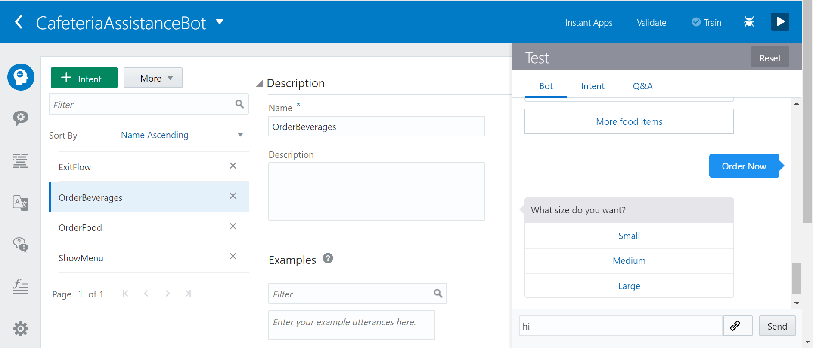

Please finish each flow if you are testing the Bot, or hit **Reset** to create a new session and avoid confusion with an incomplete flow from a previous session.

Now click the **Intent** tab. We are going to now test only the intent and entity resolution rather than a whole conversation flow.

In the message area type **Show menu** and press **Send**.

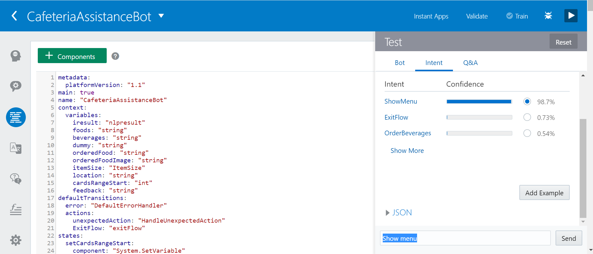

Here you can see a confidence percentage that the message is an Intent. You also see that the Show menu is recognized.

**Note:** You can see the JSON as click option here, as the user interface component, which is provided for debugging purpose while the Bot is in testing, so that you can see the JSON response to check if it's not responding properly. Once you integrate the bot with some channel i.e. Facebook messenger, Web Page this JSON option will not appear.

<!-- TODO: it would be good to add some recap text, telling the user what they have accomplished, where you can go from here, and any links to more information -->
#### You have successfully created **Cafeteria ChatBot**. You are now ready to move to the next lab.
