Integrating Instant App and a Web Channel in Digital Assistant Skill
===========================================================================
## Introduction

Skills and bots in Oracle's Autonomous Digital Assistant provide a lot of features like Instant App, Translation Services, Bot-Agent handoff, Quality, and Channels support for the Skill like Web Channel, iOS App, Android App, Facebook Messenger, and others.

Natural language conversations are, by their very nature, free-flowing. But they may not always be the best way for your Bot to collect information from its users. For example, some situations like entering credit card or passport details require users to enter specific and precise information. To help your Skill’s users enter this information easily, your Skill can call an Instant App, which provides forms with labels, options, choices, check boxes, data fields, and other UI elements. The CafeteriaAssistance Skill calls an Instant app for the Feedback that walks users through a series of steps to provide feedback.

The CafeteriaAssistance and the Instant App show you how your Bot transitions to an Instant app, how Skills pass variable values to an Instant App, and how the Instant app returns the user to the bot.


## Objectives
- Add an Instant App feature to the Skill.
- Integrate the Skill with a Web Page.


Build and Integrate Instant App and Web Channel
===========================================================================

### **Step 1**: Adding an Instant App feature to the Skill

**The Instant App Builder**


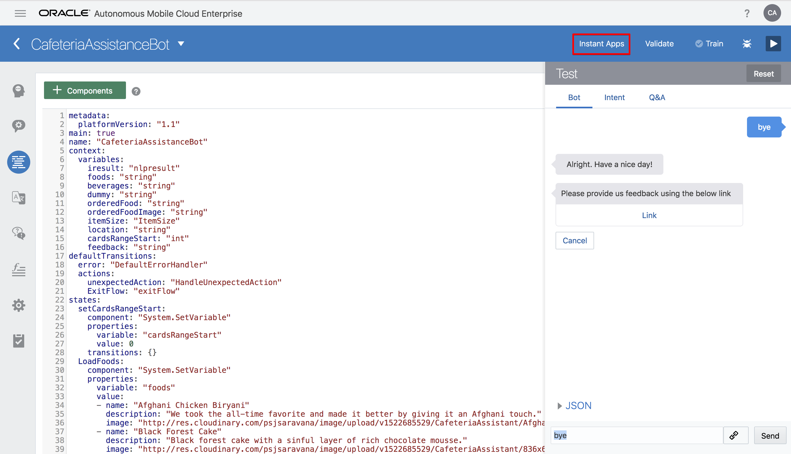

You can build the Instant Apps using the Instant App Builder, which you access by clicking Instant Apps in the Skills landing page.

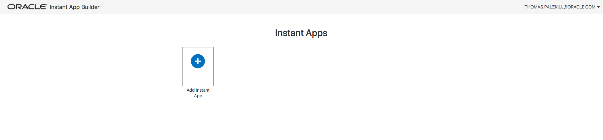

Select “Add Instant App”.

#### 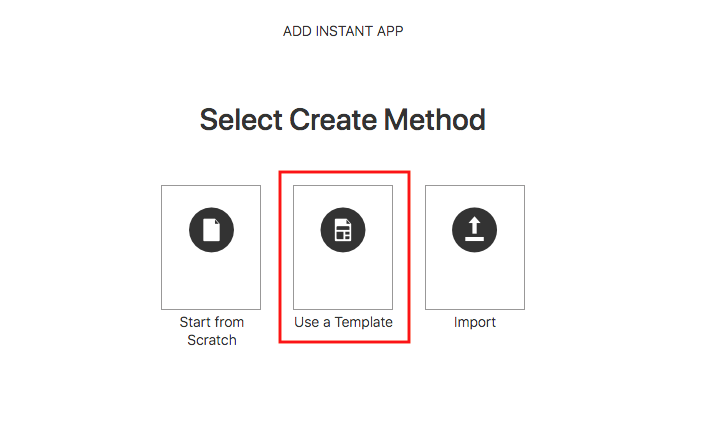

Use a template.

#### 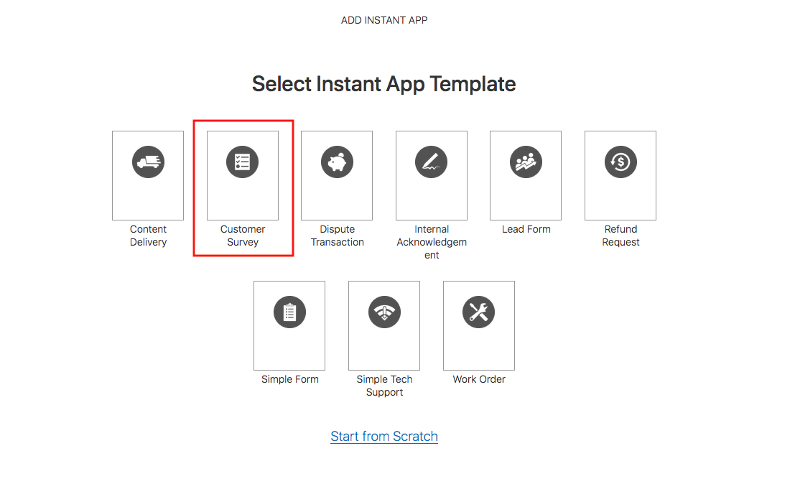

Select the “Customer Survey” template.


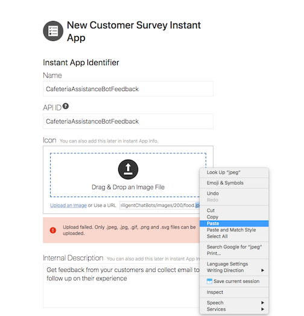


Write Name as “CafeteriaAssistanceBotFeedback” and the same for ID (case-sensitive).  Use an image, you can use the one above by right clicking and choosing "Copy Image Location", then paste that into the URL field. Add a description and click save.


**Invite Message and Link**

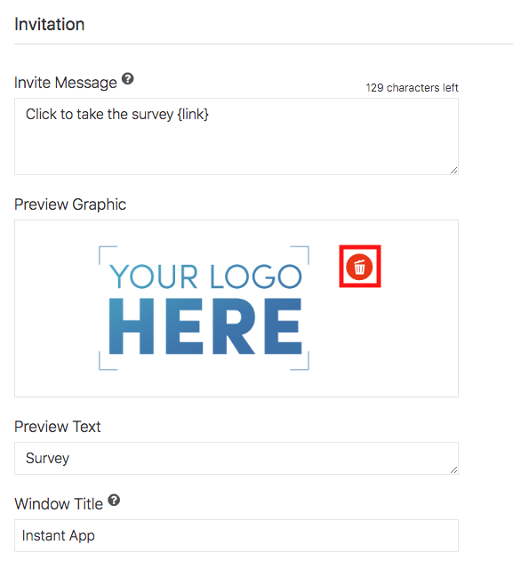

Upload the same picture to the invitation by clicking the trash icon to remove the current picture and pasting in the photo URL, leaving the other fields as their default values and click save in the top right.

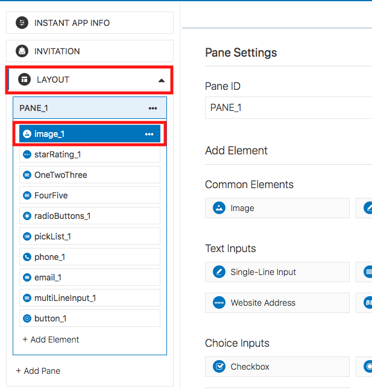

Next navigate to the left hand side of the page and expand "Layout", then select "image1".

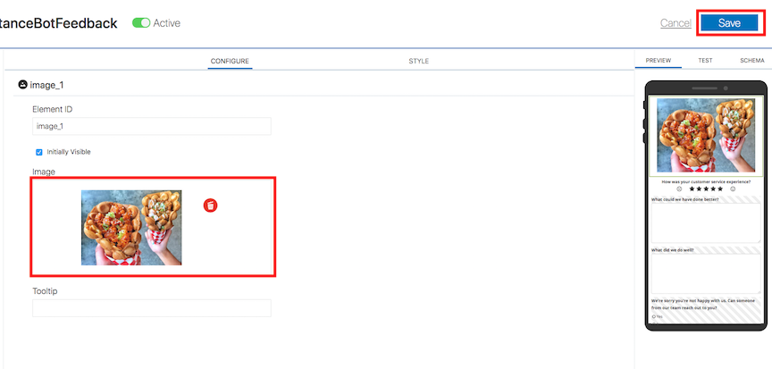

Change the image by once again choosing the trashcan icon and then pasting in the same URL you have used for the invitation. With this done ensure you click save in the top right. You can now go ahead and close this tab to return to your Skill.


**Now add the below YAML code in the flow:**

```
interactive:
   component: "System.Interactive"
   properties:
     sourceVariableList:
     variable: "feedback"
     id: "CafeteriaAssistanceBotFeedback"
     prompt: "Please provide us feedback using the below link"
   transitions: {}
 feedbackDone:
   component: "System.Output"
   properties:
     text: "Thank's for providing your valuable feedback. Have a nice day!"
     keepTurn: true
   transitions:
     return: "feedbackDone"
```
Back in the Flow section for your skill, add the above lines after the CafeteriaAssistanceBot YAML you added in Lab 100.

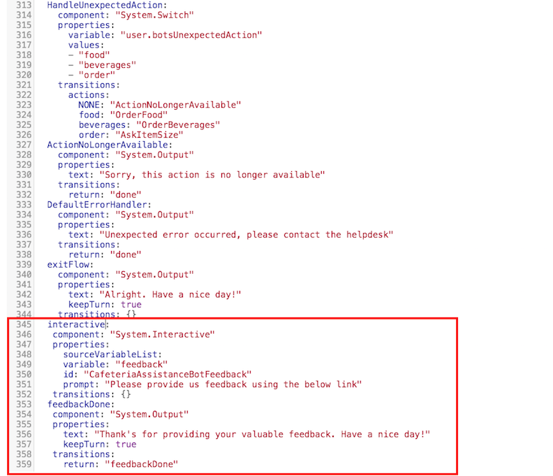

Follow the above screen for the same.

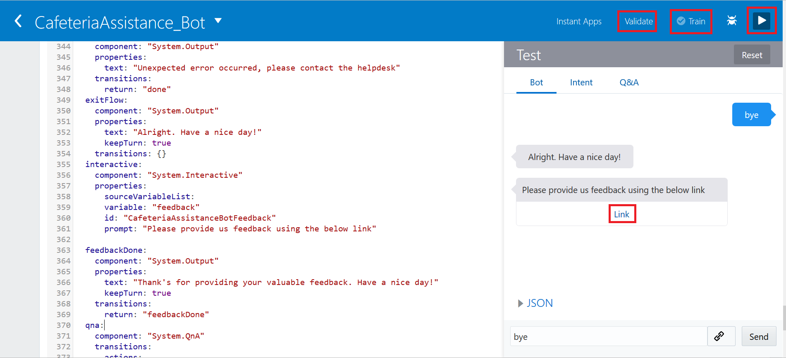

Now click “Validate”, “Train” and “Run” button to test the Instant App.

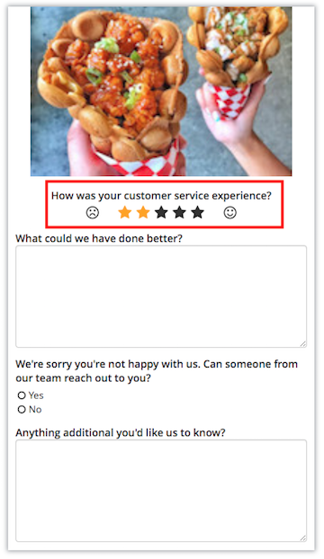

Now click the Link button, and you will be able to see the Feedback page like above.

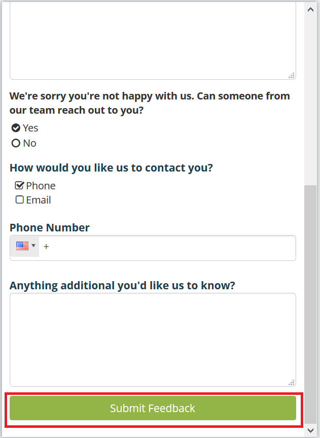

Now fill in the form, you can try different star counts to see the form change, and click on “Submit Feedback” button. When you close the tab the bot will respond with "Thank's for providing your valuable feedback. Have a nice day!", as is designated in the flow.

### **Step 2**: Integrating the Skill with a web page as a Channel

**Channels**

- To introduce your Skill to the users of these services, you need to configure a channel.

- Autonomous Digital Assistant provides channels for Facebook Messenger, Web, Android and iOS messaging platforms and a generic channel called Webhook that you can use for other messaging services. Your Skills are limited to messaging services; using one of our SDKs, you can integrate the Bot in web pages.


**Tip:**

- Your Skill can run on any messaging service that supports Webhooks, calls that allows real-time messaging without polling. You don’t need to implement a Webhook to get your Bot running on Facebook Messenger. All you need to configure the Facebook channel is the keys that are generated by both Facebook and Bots. Setting up the Webhook channel for other messaging services require you to perform a few more tasks in addition to the channel configuration, like setting up an HTTP server with a Webhook for sending and receiving your Bot’s messages.

Return to the Autonomous Digital Assistant Console. If the side menu is not open select the hamburger icon from the top right of the page, expand “Development” and select “Channels”. Ensure that “Users” is selected from the options and select “+ Channel”

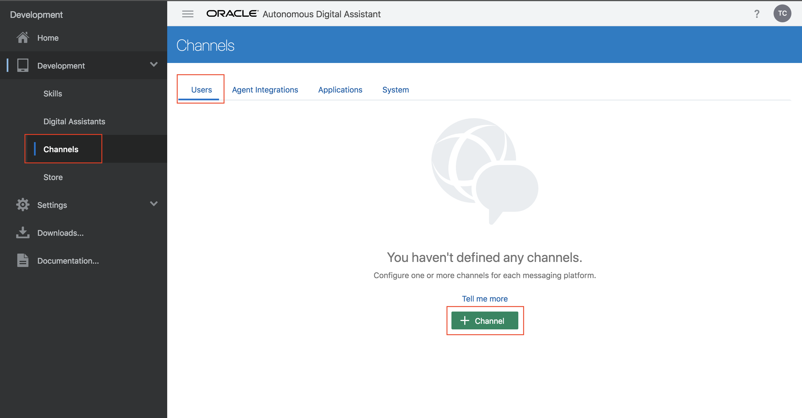

Name the channel "Web", write a brief description and choose "Channel Type” **Web**. Click **Create**.

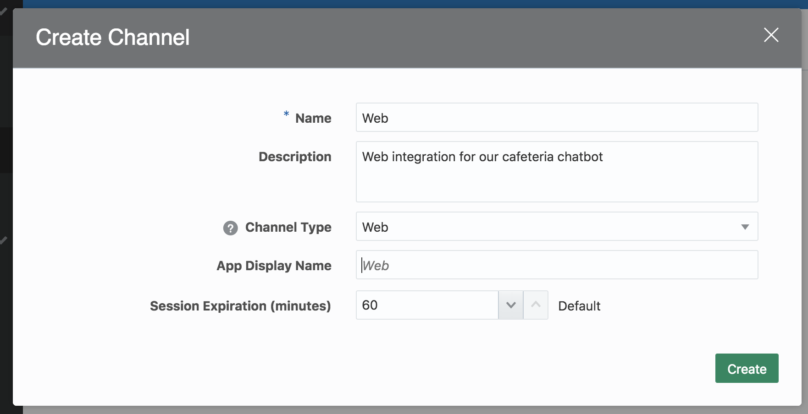

Route the Channel to your new CafeteriaAssistanceBot, enable the channel and copy the App ID.

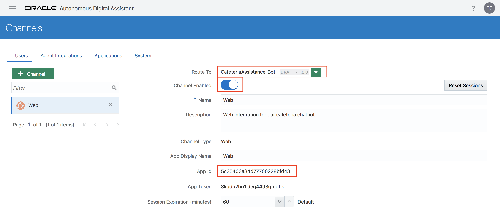

Now, unzip the below folder and then open index.html file which is inside the html folder in any text-editor.

[CafeteriaAssistanceBotWebPage.zip](https://github.com/AdityaVishwekar/IntelligentChatBots/blob/master/workshops/intelligent-chatbots/images/CafeteriaAssistanceBotWebPage.zip)

In the index.html file change the appId like below:

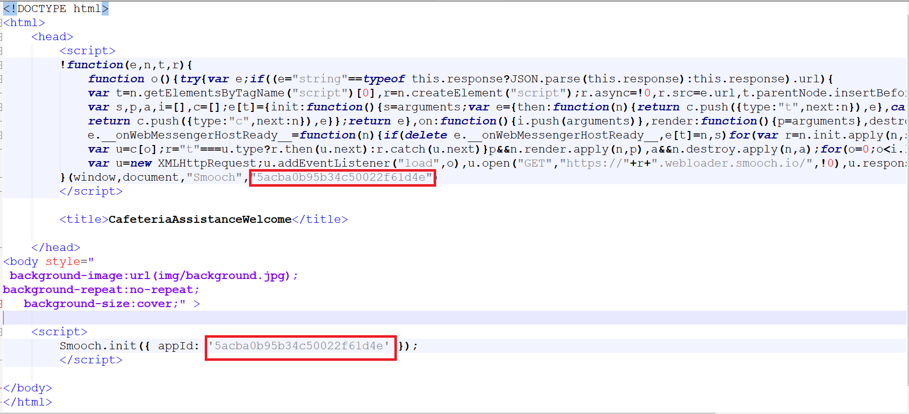

Once you change the appId, save the file and open in any browser (preferred Mozilla Firefox). It will be seen as the below screen:

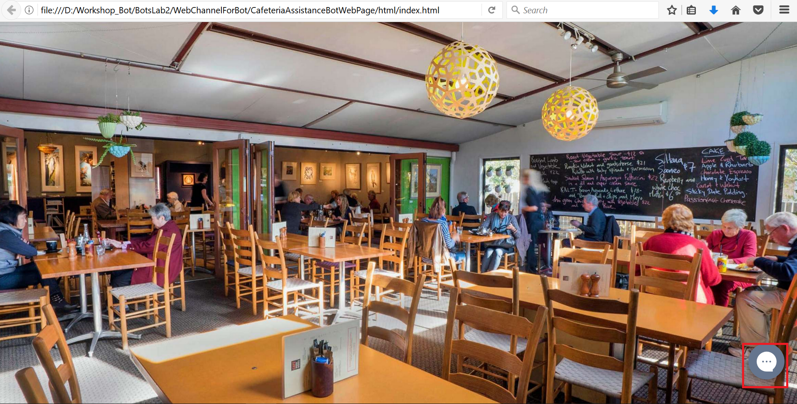

Once you click on the right-bottom corner image - ChatBot icon (marked as red in above snapshot), you can see the below screen:

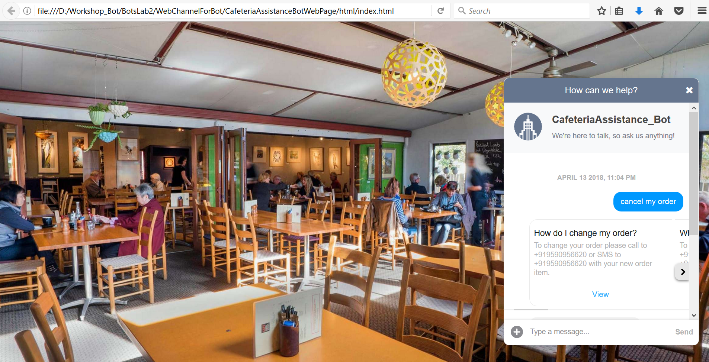

Now your ChatBot is integrated with the web page. To do testing type “ShowMenu” in a message and then click on the “Send” button.

**Note:** You can download all the related files from [Github](https://github.com/AdityaVishwekar/IntelligentChatBots/blob/master/workshops/intelligent-chatbots/images/All_files.zip)
