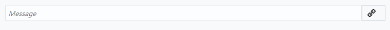

Create a Skill in Oracle Autonomous Digital Assistant
=========================

## **Introduction**
This is the first of several labs that are part of the Oracle Public Cloud Digital Assistant ChatBot workshop. This workshop will walk you through the process of creating a chatbot interface that can be integrated in any number of ways using the Oracle Public Cloud.

In Oracle's Autonomous Digital Assistant chatbots are called Skills. You can think of your Skill as a virtual personal assistant, one that completes a task through a combination of text messages and simple UI elements like select lists. While a Skill can open your enterprise to messaging, it's not a replacement for a mobile or web app. It instead provides a new channel to existing applications.


Skills enable you to connect your users to the enterprise while engaging them in naturalistic conversation. The Skills you create can respond to free-form user input because the Bots' language intelligence framework uses machine learning. While users are probably aware that they're chatting with a Bot, they don't need to limit or constrain their input.

You can build the Skill, test it, and configure it to run on different messaging services using the Skill Builder, a simple user interface. Although, you can run this Skill through Facebook Messenger and other platforms or websites, you need only write the Skill once. Digital assistant optimizes the Bot for the target platform.

## Objectives

- Create a simple Cafeteria Assistance Skill
- Create four intents
    - Create utterances
- Add an entity and associate it with your intent for this skill creation.
- Define the Conversation Flow of your Skill.
- Validate, train and test your Skill.

## Create a Skill with Intents, Entities, Utterances and Flow

### **Step 1**: Create a simple Cafeteria Assistance Skill

- When our Digital Assistant is finished provisioning select the menu icon and select **Digital Assistant UI**.

  

- Click the hamburger in the top left to open the side menu. Expand **Development** and select **Skills**.

  

- Click **New Skill**.

  

- Give the skill a name such as **CafeteriaAssistance_Bot**, version it and add a brief description. Click create and your bot is live.

  

- You are taken to the home page for your Skill. Here on the left, you can see a list of icons you can use to navigate to your **Intents, Entities, Flow, Resource Bundles, Q&A, Components, Settings and Quality**.

  

### **Step 2**: Add an Intent, Entity for show menu

- From the homepage of your Skill, click the **Intent** icon present on left-side navigation bar and then click the green **+ Intent** button.

  

- This Intent will be used to show the cafeteria menu. Enter **ShowMenu** as the Intent name, and then provide a description. _These values are automatically saved, so you do not need to explicitly save them. As you create artifacts, you may notice a message in the lower right corner that your work has been saved._

  

- Now that you have an intent we will enter our first Utterance. In the examples area add the following text, then press **Enter**:

  ```
  show menu
  ```

  

_Note: The text will disappear as it saves._

- Enter the list of example utterances below one at a time. Press **Enter** after each entry.

  ```
  what do you have?
  hi
  Hi There
  menu please
  What do you have?
  What food do you have
  ```

  _Notice that the examples do not need to be in the form of a question, they can be a statement as well._

- Your utterances will appear below as you create them.

  

### **Step 3**: Add OrderFood intent:

- Create another intent by clicking **+ Intent** near the top left. Call this one:

  ```
  OrderFood
  ```

  

- Then create the following utterances one at a time.  

  ```
    May I have some food
    Food please
    I want food
    order food
  ```

  

### **Step 4**: Add OrderBeverages intent:

- Create another intent named **OrderBeverages** with the following utterances.

    ```
    Beverages please
    Can I get beverages.
    I want beverages
    What kind of Beverages do you have?
    ```

    


### **Step 5**: Add ExitFlow intent:

- The final intent will be called **ExitFlow** using these utterances.

  ```
  Bye
  Great
  Thank You
  Thanks
  ```

  


### **Step 6**: Create Entity and Add to OrderFood Intent

- If you want the list of options i.e. sizes (based on the quantity) in this Bot for the different items users can order, you would probably need to show the list of different available sizes of the item. On the left-navigation bar, click the second icon down named **Entities** and you'll be able to view pre-populated system entities. These are standard entities that can be used in your ChatBot without having to explicitly define them.

  

- Click the green **Entity** button and then enter **ItemSize** as the entity name and the text below in the description.

  ```
  The size of item you want to be selected by the user.
  ```

  

- Now that you have an Entity, you need to provide some values that could be used. In our case of **ItemSize**, you would want to use values that represent size you could query for the order. In the **Configuration** area, ensure the **Type** property is set to **Value List** and then click the green **Value** button.

  

- In the popup dialog, enter **Small** as the value and **small** as a synonym. Then click **Create**.

  

- Press **+ Value** to add a second option.

  

- Then, add a second value named **Medium** and this time add a synonym of **normal**.

  

- Press **+ Value** one more time. Add a third value named **Large** and use **big** as the synonyms.

  

- When finished, your entity definition should look like the image shown below.

  

  _Note: Now you have 4 intents (ShowMenu, OrderFood, OrderBeverages and ExitFlow) and an entity named as ItemSize.  In the next steps you will associate the **OrderFood** and **OrderBeverages** intents with **ItemSize** entity._

- On the left-navigation bar, click the **Intent** icon, then select the **OrderFood** intent.

  

- Select the **+ Entities** button on the right side of the screen. Choose **ItemSize** from the list.

  

### **Step 7**: Define the Conversation Flow

- With the intent and entity created, the next thing we need is a Dialog flow. Click the Flow icon on the left bar.

  

-  Some code has been added to display hello when activated.  For the sake of brevity, you can simply replace all the code with the below file content (Please click the below file to copy the content):

  ```
  metadata:
    platformVersion: "1.1"
  main: true
  name: "CafeteriaAssistanceBot"
  context:
    variables:
      iresult: "nlpresult"
      foods: "string"
      beverages: "string"
      dummy: "string"
      orderedFood: "string"
      orderedFoodImage: "string"
      itemSize: "ItemSize"
      location: "string"
      cardsRangeStart: "int"
      feedback: "string"
  defaultTransitions:
    error: "DefaultErrorHandler"
    actions:
      unexpectedAction: "HandleUnexpectedAction"
      ExitFlow: "exitFlow"
  states:
    setCardsRangeStart:
      component: "System.SetVariable"
      properties:
        variable: "cardsRangeStart"
        value: 0
      transitions: {}
    LoadFoods:
      component: "System.SetVariable"
      properties:
        variable: "foods"
        value:
        - name: "Afghani Chicken Biryani"
          description: "We took the all-time favorite and made it better by giving it an Afghani touch."
          image: "http://res.cloudinary.com/psjsaravana/image/upload/v1522685529/CafeteriaAssistant/Afghani-Chicken-Biryani_2.jpg"
        - name: "Black Forest Cake"
          description: "Black forest cake with a sinful layer of rich chocolate mousse."
          image: "http://res.cloudinary.com/psjsaravana/image/upload/v1522685529/CafeteriaAssistant/836x663-Black-Forest.jpg"
        - name: "Big Crunch Chicken Classic Burger"
          description: "Juicy chicken patty seared to perfection. Then, stuffed between soft oatmeal buns along with fresh veggies. So good, you will be tongue-tied."
          image: "http://res.cloudinary.com/psjsaravana/image/upload/v1522685528/CafeteriaAssistant/Big-Crunch-Chicken-Classic-Burger.jpg"
        - name: "Big Crunch Veg Cheese Burger"
          description: "Flavourful veggie patty cooked to perfection. Then, stuffed between soft oatmeal buns with handpicked veggies. Sure to make your eye widen and jaw drop."
          image: "http://res.cloudinary.com/psjsaravana/image/upload/v1522685528/CafeteriaAssistant/Big-Crunch-Veg-Cheese-Burger_2.jpg"
        - name: "Chilli Cheese Toastizza"
          description: "Get cheesy with this crispy toast topped with onions, tomatoes and capsicum, loaded with cheese and sprinkled with chilli flakes"
          image: "http://res.cloudinary.com/psjsaravana/image/upload/v1522685528/CafeteriaAssistant/Chilli-Cheese-Toastizza_2.jpg"
        - name: "Egg Wrap"
          description: "For the Desi at heart! Classic Indian egg bhurji with onions, capsicum and paprika, folded into a scrumptious Malabar paratha wrap."
          image: "http://res.cloudinary.com/psjsaravana/image/upload/v1522685529/CafeteriaAssistant/Egg-Wrap_2.jpg"
        - name: "Crackling Brownie"
          description: "A Rich gooey classic American fudge brownie"
          image: "http://res.cloudinary.com/psjsaravana/image/upload/v1522685529/CafeteriaAssistant/836x663-Brownie.jpg"
        - name: "Crispy Veg Wrap"
          description: "We made veggies taste good. You can thank us later."
          image: "http://res.cloudinary.com/psjsaravana/image/upload/v1522685528/CafeteriaAssistant/CrispyVeg_2.jpg"
      transitions: {}

    LoadBeverages:
      component: "System.SetVariable"
      properties:
        variable: "beverages"
        value:
        - name: "Alphonso Mango Milkshake"
          description: "Discover delight in every sip with this divine, sumptuous mango treat."
          image: "http://res.cloudinary.com/psjsaravana/image/upload/v1522769202/CafeteriaAssistant/mango-milkshake-recipe.jpg"
        - name: "Aztec single origin Coffee"
          description: "A delightful international gourment blend that includes a double shot of espresso brewed from a blend of imported coffee beans topped with steamed and foamed milk."
          image: "http://res.cloudinary.com/psjsaravana/image/upload/v1522769201/CafeteriaAssistant/Aztec_single_origin_Coffee.jpg"
        - name: "Classic Lemonade"
          description: "Get refreshed! Introducing a lemonade with a touch of mint and ginger that make for the perfect sip, when you are chillin'."
          image: "http://res.cloudinary.com/psjsaravana/image/upload/v1522769202/CafeteriaAssistant/Classic_Lemonade.jpg"
        - name: "Green Tea"
          description: "An aromatic tea that does wonders for your health. The leaves are mixed with Jasmine flower bits that give a distinct fragrance and flavour. Can be served either with milk or lemon."
          image: "http://res.cloudinary.com/psjsaravana/image/upload/v1522769202/CafeteriaAssistant/Green_Tea.jpg"
        - name: "Cool Blue"
          description: "Cool Blue, a syrupy blue blend skating on crushed ice! Zap away that summer heat and enjoy a tall glass of pure shock, as you plunge your mind into CCD's summer favourite!"
          image: "http://res.cloudinary.com/psjsaravana/image/upload/v1522769201/CafeteriaAssistant/Cool_Blue.jpg"
        - name: "Macchiato"
          description: "Macchiato, meaning 'Marked' is bold espresso with a small amount of foamed milk to compliment it."
          image: "http://res.cloudinary.com/psjsaravana/image/upload/v1522769202/CafeteriaAssistant/Macchiato.jpg"
        - name: "Cold Cocoa Latte"
          description: "Smooth, creamy ice cold chocolate milkshake. Who can say no to this classic beverage?"
          image: "http://res.cloudinary.com/psjsaravana/image/upload/v1522769201/CafeteriaAssistant/Cold_Cocoa_Latte.jpg"
        - name: "Café Americano"
          description: "A double shot of espresso topped with hot water, served with a complimentary milk on the side."
          image: "http://res.cloudinary.com/psjsaravana/image/upload/v1522769202/CafeteriaAssistant/Caf%C3%A9_Americano.jpg"
      transitions: {}  
    Intent:
      component: "System.Intent"
      properties:
        variable: "iresult"
      transitions:
        actions:
          unresolvedIntent: "Unresolved"
          OrderBeverages: "OrderBeverages"
          ShowMenu: "ShowMenu"
          OrderFood: "OrderFood"
    Unresolved:
      component: "System.CommonResponse"
      properties:
        metadata:
          responseItems:
          - type: "text"
            text: "Sorry, I don't understand you, I am not human. Please try another\
              \ sentence."
            name: "Sorry"
            separateBubbles: true
        processUserMessage: false
      transitions:
        return: "done"
    ShowMenu:
      component: "System.CommonResponse"
      properties:
        metadata:
          responseItems:
          - type: "text"
            text: "Hello ${profile.firstName}, this is our menu for today:"
            name: "hello"
            separateBubbles: true
            actions:
            - label: "Food"
              keyword: "1"
              type: "postback"
              payload:
                action: "Food"
              name: "Food"
            - label: "Beverages"
              keyword: "2"
              type: "postback"
              payload:
                action: "Beverages"
              name: "Beverages"         
        processUserMessage: true
      transitions:
        actions:
          Food: "OrderFood"
          Beverages: "OrderBeverages"
          textReceived: "Intent"
    OrderFood:
      component: "System.CommonResponse"
      properties:
        metadata:
          responseItems:
          - type: "text"
            text: "Here are our food items you can order today"
            separateBubbles: true
            rendered: "<#if cardsRangeStart?number == 0>true<#else>false</#if>"
            name: "Our foods"
          - type: "text"
            text: "Some more items for you:"
            separateBubbles: true
            rendered: "<#if cardsRangeStart?number != 0>true<#else>false</#if>"
            name: "More food items"
          - type: "cards"
            cardLayout: "vertical"
            name: "FoodCards"
            actions:
            - label: "More food items"
              type: "postback"
              rendered: "<#if cardsRangeStart?number+4 < foods.value?size>true<#else>false</#if>"
              payload:
                action: "more"
                variables:
                  cardsRangeStart: "${cardsRangeStart?number+4}"
              name: "More"
            cards:
            - title: "${foods.name}"
              description: "${foods.description}"
              imageUrl: "${foods.image}"
              name: "FoodCard"
              iteratorVariable: "foods"
              rangeStart: "${cardsRangeStart}"
              rangeSize: "4"
              actions:
              - label: "Order Now"
                type: "postback"
                payload:
                  action: "order"
                  variables:
                    orderedFood: "${foods.name}"
                    orderedFoodImage: "${foods.image}"
                name: "Order"
            channelCustomProperties:
            - channel: "facebook"
              properties:
                top_element_style: "large"
        processUserMessage: true
      transitions:
        actions:
          order: "AskItemSize"
          more: "OrderFood"
          textReceived: "Intent"

    OrderBeverages:  
      component: "System.CommonResponse"
      properties:
        metadata:
          responseItems:
          - type: "text"
            text: "Here are our beverages you can order today"
            separateBubbles: true
            rendered: "<#if cardsRangeStart?number == 0>true<#else>false</#if>"
            name: "Our beverages"
          - type: "text"
            text: "Some more items for you:"
            separateBubbles: true
            rendered: "<#if cardsRangeStart?number != 0>true<#else>false</#if>"
            name: "More beverages"
          - type: "cards"
            cardLayout: "vertical"
            name: "BeveragesCards"
            actions:
            - label: "More beverages items"
              type: "postback"
              rendered: "<#if cardsRangeStart?number+4 < beverages.value?size>true<#else>false</#if>"
              payload:
                action: "more"
                variables:
                  cardsRangeStart: "${cardsRangeStart?number+4}"
              name: "More"
            cards:
            - title: "${beverages.name}"
              description: "${beverages.description}"
              imageUrl: "${beverages.image}"
              name: "BeveragesCard"
              iteratorVariable: "beverages"
              rangeStart: "${cardsRangeStart}"
              rangeSize: "4"
              actions:
              - label: "Order Now"
                type: "postback"
                payload:
                  action: "order"
                  variables:
                    orderedFood: "${beverages.name}"
                    orderedFoodImage: "${beverages.image}"
                name: "Order"
            channelCustomProperties:
            - channel: "facebook"
              properties:
                top_element_style: "large"
        processUserMessage: true
      transitions:
        actions:
          order: "AskItemSize"
          more: "OrderFood"
          textReceived: "Intent"
    AskItemSize:
      component: "System.CommonResponse"
      properties:
        variable: "itemSize"
        nlpResultVariable: "iresult"
        maxPrompts: 2
        metadata:
          responseItems:
          - type: "text"
            text: "<#if user.botsUserError == 'true'>Invalid size, please try again.\
              \ </#if>What size do you want?"
            name: "What size"
            separateBubbles: true
            actions:
            - label: "${enumValue}"
              type: "postback"
              payload:
                action: ""
                variables:
                  itemSize: "${enumValue}"
              name: "size"
              iteratorVariable: "itemSize.type.enumValues"
        processUserMessage: true
      transitions:
        actions:
          cancel: "Intent"
        next: "AskLocation"
    AskLocation:
      component: "System.CommonResponse"
      properties:
        variable: "location"
        metadata:
          responseItems:
          - text: "To which location do you want the item to be delivered?"
            type: "text"
            name: "What location"
            separateBubbles: true
          globalActions:
          - label: "Send Location"
            type: "location"
            name: "SendLocation"
        processUserMessage: true
      transitions:
        actions:
          cancel: "Intent"
        next: "Confirmation"
    Confirmation:
      component: "System.CommonResponse"
      properties:
        metadata:
          responseItems:
          - text: "Thank you for your order, your ${itemSize} ${orderedFood} \
              \ will be delivered in 10 minutes at GPS position ${location.value.latitude},${location.value.longitude}!"
            type: "text"
            name: "conf"
            separateBubbles: true
          - type: "attachment"
            attachmentType: "image"
            name: "image"
            attachmentUrl: "${orderedFoodImage}"
        processUserMessage: false
      transitions:
        return: "done"
    HandleUnexpectedAction:
      component: "System.Switch"
      properties:
        variable: "user.botsUnexpectedAction"
        values:
        - "food"
        - "beverages"
        - "order"
      transitions:
        actions:
          NONE: "ActionNoLongerAvailable"
          food: "OrderFood"
          beverages: "OrderBeverages"
          order: "AskItemSize"
    ActionNoLongerAvailable:
      component: "System.Output"
      properties:
        text: "Sorry, this action is no longer available"
      transitions:
        return: "done"
    DefaultErrorHandler:
      component: "System.Output"
      properties:
        text: "Unexpected error occurred, please contact the helpdesk"
      transitions:
        return: "done"
    exitFlow:
      component: "System.Output"
      properties:
        text: "Alright. Have a nice day!"
        keepTurn: true
      transitions: {}
  ```
### **Step 8**: Validate, Train and Test your Skill

- Finally, click the **Validate** button in the upper right corner.

  

- You should see a message that there were no problems found in your skill before proceeding.

  

- In the upper right, click the **Train** button.

  

- This will kick-off a process that will run an algorithm to take your example utterances and build the model that will be used to ascertain the intents and entities.

  

  _Note: Oracle provides three models that learn from your corpus: Trainer Ht ,Trainer Tm and Q&A Training. Each uses a different algorithm to reconcile the user input against your intents. Trainer Ht uses pattern matching while Trainer Tm detects variations in user input and Q&A training is used to train for the pre-defined question and answers. You'd typically follow training process when you're creating intents:

    a.  Choose Trainer Ht from the options.

    b.  Refine your corpus, retrain with Trainer Ht. Repeat as necessary.

  The Train button () activates whenever you add an intent or when you update an intent by adding, changing, or deleting its utterances. To bring the training up to date, choose a training model and then click **Train**. The model displays an exclamation point whenever it needs training. When its training is current, it displays a check mark._


- Now we will test our Digital Assistant by clicking the **play** (Run) icon in the upper right of the page. This takes you into the tester

  

- Here you can see three tabs: **Conversation, Intent/QnA and View JSON**.

  

- What you type in at the bottom in the **Message** area, is what will be sent to the skill when you click the **Send** button.

  

- Let's start out simple to test the skill: In the Message area, type
```
Show menu
```
and press **return**.

  

- The skill will show cafeteria menu for you with two options. Click **Food** and the details for that item is displayed.

  

- Select **Order Now**.

  

- Now, let's try a message that includes the **ItemSize** by selecting **Small**.

  

- Click on the **Conversation** tab to see the flow of intents the skill recognizes throughout the conversation.

  

- Now reset your skill by clicking the **Reset** button above the chat window.

  

- In the message area type **Show menu** and press **Return**.

    

- Then click the **Intent/Q&A** tab. Here you can see a confidence percentage that the message is an Intent. You also see that the Show menu is recognized.


- Click the **View JSON** tab. You can see the JSON as click option here, as the user interface component, which is provided for debugging purpose while the skill is in testing, so that you can see the JSON response to check if it's not responding properly. Once you integrate the skill with some channel i.e. Facebook messenger, Web Page this JSON option will not appear.


# You have successfully completed this lab.

- You may proceed to [Lab 200](LabGuide200.md)
