Integrating Instant App and a Web Channel in Digital Assistant Skill
===========================================================================
## Introduction

Skills and bots in Oracle's Autonomous Digital Assistant provide a lot of features like Instant App, Translation Services, Bot-Agent handoff, Quality, and Channels support for the Skill like Web Channel, iOS App, Android App, Facebook Messenger, and others.

Natural language conversations are, by their very nature, free-flowing. But they may not always be the best way for your Bot to collect information from its users. For example, some situations like entering credit card or passport details require users to enter specific and precise information. To help your Skill’s users enter this information easily, your Skill can call an Instant App, which provides forms with labels, options, choices, check boxes, data fields, and other UI elements. The CafeteriaAssistance Skill calls an Instant app for the Feedback that walks users through a series of steps to provide feedback.

The CafeteriaAssistance and the Instant App show you how your Bot transitions to an Instant app, how Skills pass variable values to an Instant App, and how the Instant app returns the user to the bot.


## Objectives
- Add an Instant App feature to the Skill.
- Integrate the Skill with a Web Page.


Build and Integrate Instant App and Web Channel
===========================================================================

### **Step 1**: Adding an Instant App feature to the Skill


Once you click on the Link button, you will get a form like below to fill:


**The Instant App Builder**


You can build the Instant Apps using the Instant App Builder, which you access by clicking Instant Apps in the Skills landing page.

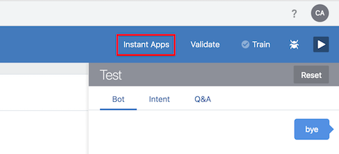
Instant apps are made up of sets of panes, which gets displayed one at a time. You can populate these panes with various elements that can display charts or images and collect customer data using widgets like checkboxes, radio buttons, and file upload functions.


To get you started, you can customize the templates that display in the landing page. You can also start from scratch by clicking the **New Instant App** tile. 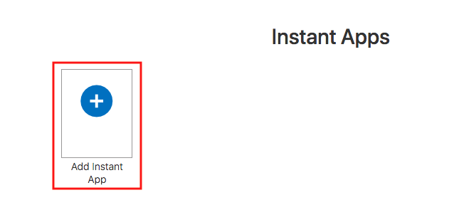

**Creating an Instant App for feedback**

Select “Add Instant App”.

#### 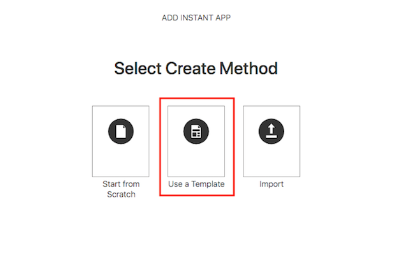

Use a template.

#### 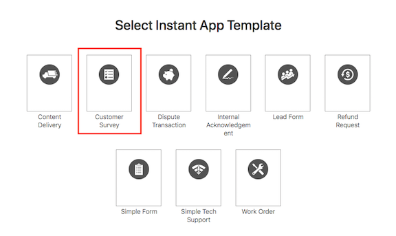

Select the “Customer Survey” template.

#### **App Settings**

App Settings is where you manage general information about your Instant App.

**Name**

The Instant App name is your internal way of identifying the specific Instant App among all your other Instant Apps on main page. The name can include letters, numbers, and special characters. The name is not exposed to the end user, as you can see in the image Internal Description below.

**ID**

The Instant App ID is how you reference the Instant App if you need to call it from somewhere, like from a Bot, an API, or a JavaScript Snippet. When you create a new Instant App, the ID itself is derived from the Instant App name that you enter. The ID cannot contain special characters or spaces. You can edit the ID at any point, but if you do change it, you will need to update any references to the previous ID.

**Icon**

An icon is the image that shows up on the Instant App tile on the main Instant Apps page. You can remove unwanted icons by clicking on the red X on the top right corner. Then, you can drag and drop an icon, add an icon via regular file lookup, or input a URL.

**Internal Description**

The Internal Description is what shows up on the Instant App’s tile on the main Instant Apps page as a reminder of the particular Instant App’s function.


Write Name as “CafeteriaAssistanceBotFeedback” and the same for ID (case-sensitive).  Use an image, you can use the one above by right-clicking and selecting "Copy Image Location". Add a description and click save.


**Invite Message and Link**

The Invite Message is a pre-configured message that is sent to customers as an invitation to use the Instant App, and it is the first thing a customer sees.  Include the {link} in the position where you want the Instant App link, and do not change anything else. The message, including the link, cannot exceed 160 characters.

Upload the same picture to the invitation, leaving the other fields as their default values and click save.


Before proceeding, don’t forget to click on the save button.

Now add the below lines after in the CafeteriaAssistanceBot lab1 YAML flow like below:

**Now add the below YAML code in the flow:**

```
interactive:
   component: "System.Interactive"
   properties:
     sourceVariableList:
     variable: "feedback"
     id: "CafeteriaAssistanceBotFeedback"
     prompt: "Please provide us feedback using the below link"
   transitions: {}
 feedbackDone:
   component: "System.Output"
   properties:
     text: "Thank's for providing your valuable feedback. Have a nice day!"
     keepTurn: true
   transitions:
     return: "feedbackDone"
```

Follow the below screen for the same:

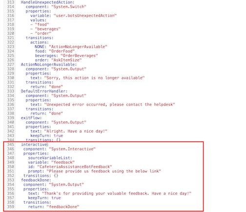

Now click “Validate”, “Train” and “Run” button to test the Instant App:

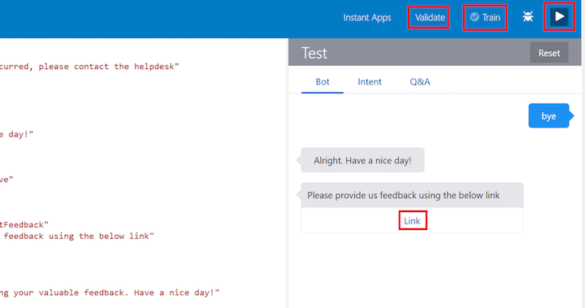

Now click the Link button, and you will be able to see the Feedback page like below:


Now fill the form and click on “Submit Feedback” button:

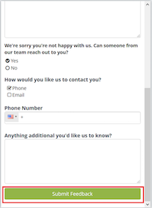

Now, if you go back to the Skill you can see the response similar to the one below:


### **Step 2**: Integrating the Skill with a web page as a Channel

**Channels**

- To introduce your Skill to the users of these services, you need to configure a channel.

- Autonomous Digital Assistant provides channels for Facebook Messenger, Web, Android and iOS messaging platforms and a generic channel called Webhook that you can use for other messaging services. Your Skills are limited to messaging services; using one of our SDKs, you can integrate the Bot in web pages.


**Tip:**

- Your Skill can run on any messaging service that supports Webhooks, calls that allows real-time messaging without polling. You don’t need to implement a Webhook to get your Bot running on Facebook Messenger. All you need to configure the Facebook channel is the keys that are generated by both Facebook and Bots. Setting up the Webhook channel for other messaging services require you to perform a few more tasks in addition to the channel configuration, like setting up an HTTP server with a Webhook for sending and receiving your Bot’s messages.

Return to the Autonomous Digital Assistant Console. If the side menu is not open select the hamburger icon from the top right of the page, expand “Development” and select “Channels”. Ensure that “Users” is selected from the options and select “+ Channel”

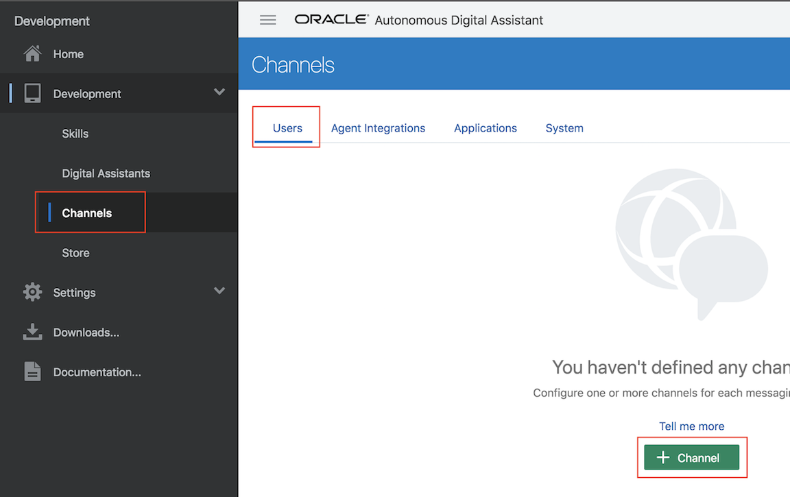

Name the channel "Web", write a brief description and choose "Channel Type” **Web**. Click **Create**.

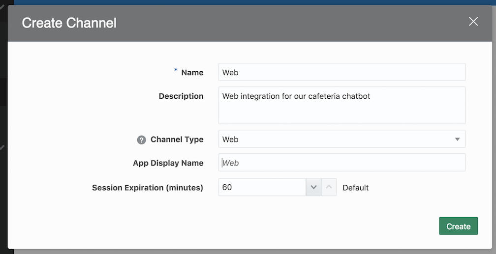

Route the Channel to your new CafeteriaAssistanceBot, enable the channel and copy the App ID.

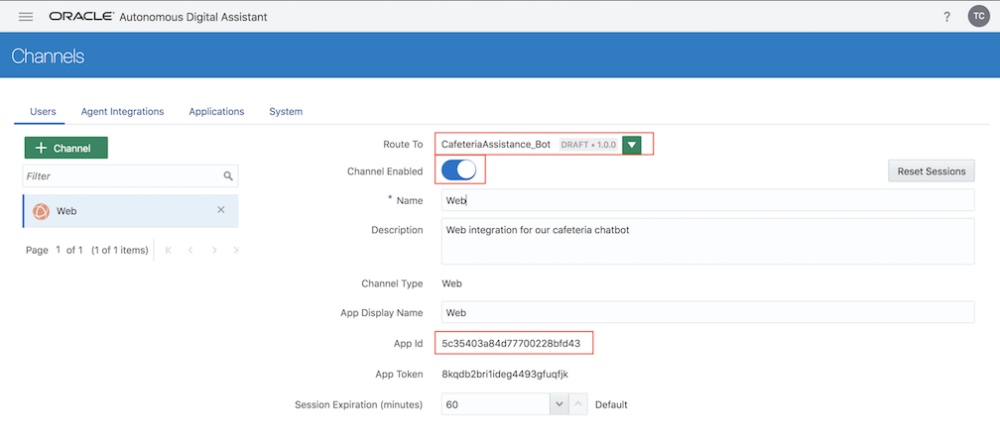

Now, unzip the below folder and then open index.html file which is inside the html folder in any text-editor.

[CafeteriaAssistanceBotWebPage.zip](https://github.com/AdityaVishwekar/IntelligentChatBots/blob/master/workshops/intelligent-chatbots/images/CafeteriaAssistanceBotWebPage.zip)

In the index.html file change the appId like below:

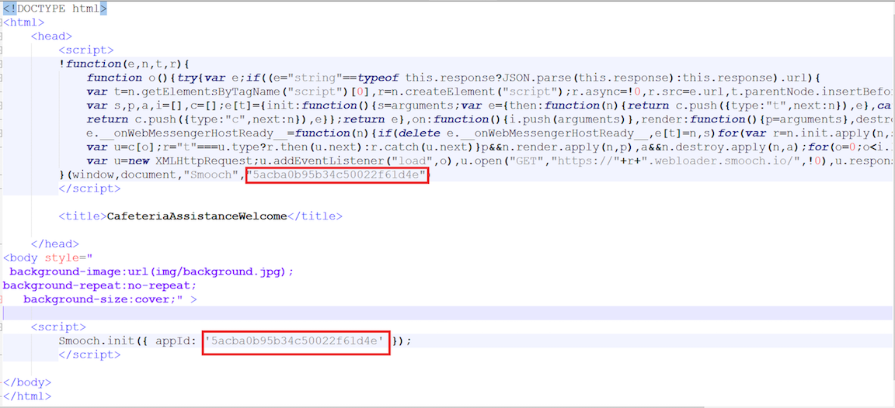

Once you change the appId, save the file and open in any browser (preferred Mozilla Firefox). It will be seen as the below screen:

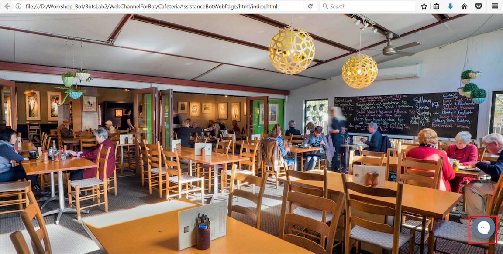

Once you click on the right-bottom corner image - ChatBot icon (marked as red in above snapshot), you can see the below screen:

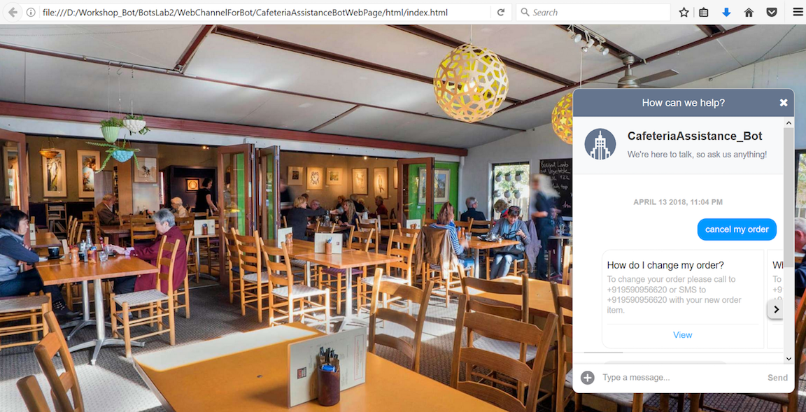

Now your ChatBot is integrated with the web page. To do testing type “ShowMenu” in a message and then click on the “Send” button.

**Note:** You can download all the related files from [Github](https://github.com/AdityaVishwekar/IntelligentChatBots/blob/master/workshops/intelligent-chatbots/images/All_files.zip)
